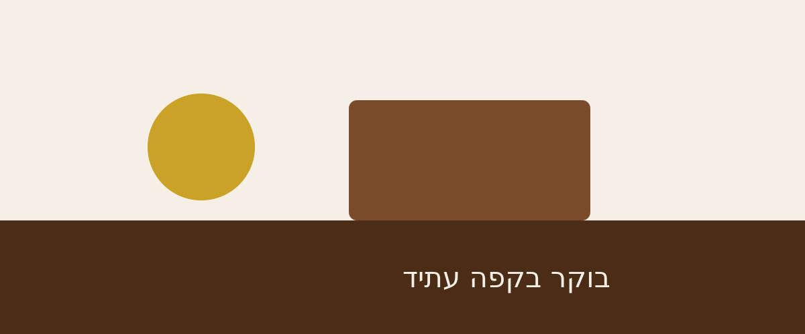

<div dir="rtl" align="right">

# 🏗️ שלב 04 – פיצול לארבעה דפים

> **הפרויקט המתמשך של הכיתה: קפה עתיד**
> נלמד ב־[HTML · מודול 4 – קישורים ותמונות](../../../01-html/04-links-images/) · [⏮️ שלב 03](../step-03-html-lists-tables/) · [🗺️ מפת הפרויקט](../../)

---

## 🎯 מה מוסיפים היום

- **הדף האחד הופך לאתר.** מפצלים ל-`index.html`, `menu.html`, `about.html`, `contact.html`.
- בונים **סרגל ניווט** זהה בכל דף, שבו הדף הנוכחי לא מקושר לעצמו.
- מוסיפים תיקיית `images/` עם לוגו, תמונת ראשי וגלריה – ולומדים נתיבים יחסיים.
- כותבים `alt` שמתאר **הקשר**, ומצמידים `width`/`height` לכל תמונה.

</div>

<div dir="rtl" align="right">

## 🌍 למה זה ככה בעולם האמיתי

### נתיבים – החלק שהכי מבלבל

זו הטעות מספר אחת בכל קורס. הדף עובד אצלכם, ואצל המרצה יש ריבוע שבור.

</div>

```text
cafe-atid/
├── index.html
├── menu.html
└── images/
    └── logo.svg
```

<div dir="rtl" align="right">

| מתוך | הכתובת לתמונה | למה |
|-------|-----------------|------|
| `index.html` | `images/logo.svg` | יורדים תיקייה אחת פנימה |
| `pages/deals.html` | `../images/logo.svg` | `../` = עולים תיקייה אחת |
| כל מקום | `/images/logo.svg` | **מהשורש של האתר** – עובד רק על שרת, לא בקובץ מקומי |

**הכלל היחיד שצריך לזכור:** הנתיב נמדד מ**הקובץ שבו כתוב הקישור**, לא מהתיקייה שפתוחה
לכם בעורך.

### `width` ו-`height` – שתי מילים ששוות דירוג בגוגל

</div>

```html

```

<div dir="rtl" align="right">

בלי המספרים האלה, הדפדפן לא יודע כמה מקום לשריין לתמונה שעוד לא הורדה.
הוא מציג את הטקסט, ואז התמונה נוחתת **ודוחפת את כל הדף למטה** – בדיוק כשהמשתמש
לחץ על משהו. המדד נקרא **CLS**, וגוגל מוריד בגללו דירוג.

נסו: פתחו את הדף, `F12` ← Network ← Slow 3G ← רענון.

### `alt` – תלוי הקשר, לא תיאור של פיקסלים

| התמונה | ה-`alt` הנכון |
|---------|-----------------|
| לוגו בסרגל | `alt="קפה עתיד"` – זה מה שהקישור **עושה**, לא איך הוא נראה |
| תמונת גלריה | `alt="הדלפק והמכונה"` |
| קישוט טהור (קו מפריד) | `alt=""` – ריק **בכוונה**, כדי שקורא מסך ידלג |

**`alt=""` ריק זה לא "שכחתי". זו הצהרה.** להשמיט את התכונה לגמרי – זו כן שכחה,
ואז קורא המסך מקריא את שם הקובץ: *"gallery dash one dot svg"*.

</div>
<div dir="rtl" align="right">

---

## 🔨 שלב אחר שלב

### 1. מחליטים מה הולך לאן

| הדף | מה עובר אליו |
|------|----------------|
| `index.html` | ראשי, שלוש נקודות מכירה, ציטוט, שעות פתיחה |
| `menu.html` | כל התפריט + מילון המונחים |
| `about.html` | הסיפור, סדר הכנת הקפה, גלריה |
| `contact.html` | כתובת, טלפון, מייל (הטופס – בשלב הבא) |

### 2. סרגל ניווט זהה בכל דף

</div>

```html

<p>
  <a href="index.html">בית</a> |
  <b>התפריט</b> |
  <a href="about.html">עלינו</a> |
  <a href="contact.html">צרו קשר</a>
</p>
<hr>
```

<div dir="rtl" align="right">

**שימו לב:** בדף התפריט, "התפריט" הוא `<b>` ולא `<a>`. **לא מקשרים דף לעצמו** –
זה מבלבל ומיותר. בשלב 06 נחליף את הטריק הזה בפתרון נכון יותר (`aria-current`).

### 3. קישורים חיצוניים – שתי מילים חובה

</div>

```html
<a href="https://www.instagram.com/" target="_blank" rel="noopener">אינסטגרם</a>
```

<div dir="rtl" align="right">

- `target="_blank"` – נפתח בלשונית חדשה.
- `rel="noopener"` – **חובה אבטחתית**. בלעדיו, לדף שנפתח יש גישה ל-`window.opener`
  והוא יכול להחליף את הלשונית שלכם בדף פישינג.

### 4. קישורים שהם לא לדפים

</div>

```html
<a href="tel:+97231234567">03-1234567</a>
<a href="mailto:hello@cafe-atid.co.il">hello@cafe-atid.co.il</a>
```

<div dir="rtl" align="right">

בטלפון, `tel:` פותח את החייגן. זה ההבדל בין לקוח שמתקשר לבין לקוח שמעתיק מספר ידנית.

### 5. טקסט קישור שעומד בפני עצמו

**❌** `לפרטים על התפריט <a href="menu.html">לחצו כאן</a>`
**✅** `<a href="menu.html">למעבר לתפריט המלא</a>`

משתמש בקורא מסך מבקש **רשימה של כל הקישורים בדף**. רשימה של שמונה
"לחצו כאן" היא חסרת ערך. זו גם דרישה בתקן הישראלי לנגישות (ת״י 5568).

---

## 💻 הקוד המלא של השלב

ארבעה דפים – הנה המבנה שחוזר בכולם:

</div>

```html
<body>

  
  <p><a href="index.html">בית</a> | <a href="menu.html">התפריט</a> | <b>עלינו</b> | <a href="contact.html">צרו קשר</a></p>
  <hr>

  <h1>עלינו</h1>
  ...תוכן הדף...

  <hr>
  <p><small>&copy; 2026 קפה עתיד &nbsp;·&nbsp; הרצל 42, תל אביב</small></p>

</body>
```

<div dir="rtl" align="right">

הקבצים המלאים: **[`index.html`](index.html)** · **[`menu.html`](menu.html)** ·
**[`about.html`](about.html)** · **[`contact.html`](contact.html)**

## 👀 מה רואים במסך

- לוגו בראש כל דף, ומתחתיו שורת ניווט עם מפרידים.
- **לחיצה על "התפריט" באמת מעבירה דף.** זה הרגע שבו זה מרגיש כמו אתר.
- בדף "עלינו" – שלוש תמונות גלריה זו מתחת לזו (עדיין לא בשורה. Grid מגיע בשלב 13).
- בדף "צרו קשר" – לחיצה על מספר הטלפון במובייל פותחת את החייגן.

---

## 📂 מה יש בתיקייה עכשיו

</div>

```text
cafe-atid/
├── index.html
├── menu.html
├── about.html
├── contact.html
└── images/
    ├── logo.svg
    ├── hero.svg
    ├── gallery-1.svg
    ├── gallery-2.svg
    └── gallery-3.svg
```

<div dir="rtl" align="right">

## ✋ אתגר לכיתה

1. הוסיפו דף חמישי `jobs.html` ("דרושים") וקשרו אותו מכל ארבעת הדפים.
2. בתוך `about.html`, שנו את הנתיב של `gallery-2.svg` ל-`../images/gallery-2.svg`.
   שמרו ורעננו – מה קרה, ולמה?
3. בגלריה, הוסיפו תמונה רביעית שהיא **קישוט בלבד**. מה יהיה ה-`alt` שלה?

</div>
</div>

<details dir="rtl">
<summary><b>💡 הצגת הפתרון</b></summary>

<div dir="rtl" align="right">

**1.** קובץ חדש בשורש (לא בתוך תיקייה), ובכל אחד מחמשת הדפים מוסיפים
`<a href="jobs.html">דרושים</a>` לשורת הניווט. בתוך `jobs.html` עצמו – `<b>דרושים</b>`.

**2. התמונה נשברה.** `../` אומר "עלה תיקייה אחת", כלומר מחוץ ל-`cafe-atid/`.
שם אין `images/`. הנתיב הנכון מ-`about.html` הוא `images/gallery-2.svg`,
כי `about.html` יושב **באותה רמה** כמו התיקייה `images`.

זו בדיוק התקלה שתפגשו בפרויקט האמיתי. הכלל: **נתיב נמדד מהקובץ שבו הוא כתוב.**

**3.** `alt=""` – ריק. תמונה שלא נושאת מידע צריכה להיות שקופה לקורא מסך.
אם נכתוב `alt="קישוט"`, המשתמש ישמע "תמונה, קישוט" ויתהה מה הוא מפספס.

</div>
</details>

<div dir="rtl" align="right">
<div dir="rtl" align="right">

---

## 🔍 טעויות שראינו בכיתה

| הטעות | התוצאה |
|--------|---------|
| `href="C:\Users\me\Desktop\menu.html"` | עובד רק במחשב שלכם. תמיד נתיב יחסי |
| `href="Menu.html"` והקובץ `menu.html` | על שרת Linux זו שגיאת 404. רישיות קובעות |
| `` בלי `alt` בכלל | קורא מסך מקריא את שם הקובץ |
| `target="_blank"` בלי `rel="noopener"` | חור אבטחה מיותר |

</div>

<div dir="rtl" align="right">

---

## ⏭️ בשלב הבא

**[שלב 05 – טופס הזמנת שולחן](../step-05-html-forms/)**

[🗺️ חזרה למפת הפרויקט](../../)

</div>
