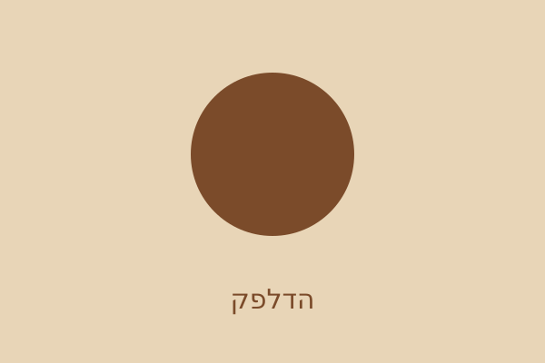

<div dir="rtl" align="right">

# 🏗️ שלב 07 – וידאו, מפה ותצוגה ברשתות

> **הפרויקט המתמשך של הכיתה: קפה עתיד**
> נלמד ב־[HTML · מודול 7 – מדיה ו-iframe](../../../01-html/07-media-iframe/) · [⏮️ שלב 06](../step-06-html-semantic/) · [🗺️ מפת הפרויקט](../../)

---

## 🎯 מה מוסיפים היום

- מוסיפים **וידאו** בדף הבית עם `poster`, `controls` וכתוביות `<track>` בעברית.
- משבצים **מפה** ב-`<iframe>` עם `title` ו-`loading="lazy"`.
- מוסיפים תגיות **Open Graph** – כך הקישור ייראה כשישלחו אותו בוואטסאפ.
- משדרגים את הגלריה ל-`<picture>` שמגיש תמונה רחבה במסך גדול.

</div>

<div dir="rtl" align="right">

## 🌍 למה זה ככה בעולם האמיתי

### הניסוי של הוואטסאפ

שלחו לעצמכם קישור לאתר של עסק כלשהו. קיבלתם ריבוע עם תמונה, כותרת ותיאור.
זה לא קסם – וואטסאפ קרא **ארבע שורות** מה-`<head>`:

</div>

```html
<meta property="og:title" content="קפה עתיד – בית קפה שכונתי בתל אביב">
<meta property="og:description" content="בית קפה שכונתי ברחוב הרצל 42 בתל אביב.">
<meta property="og:image" content="images/og-cover.svg">
<meta property="og:type" content="website">
```

<div dir="rtl" align="right">

> ⚠️ **המלכודת שתפילו עליה את כולם:** ב-Open Graph כותבים **`property=`** ולא `name=`.
> `<meta name="og:title">` נראה זהה לחלוטין, נטען בלי שגיאה – **ופייסבוק מתעלם ממנו**.
> חצי שעה של חיפוש באג.

**מלכודת שנייה:** `og:image` חייב להיות **כתובת מלאה** (`https://...`), כי השרת של
וואטסאפ מוריד את התמונה מבחוץ ולא יודע איפה "images/" יושב. אצלנו נשאר נתיב יחסי
כי אנחנו עדיין מקומיים – ברגע שהאתר עולה לאוויר, זה הדבר הראשון לתקן.

### כתוביות זה לא רק לכבדי שמיעה

85% מהצפיות בווידאו ברשתות הן **בלי סאונד**. וידאו בלי כתוביות הוא וידאו
שרוב האנשים לא צופים בו.

| הסוג | מה זה |
|-------|--------|
| `kind="captions"` | הכול: דיבור + *"[מכונת אספרסו רוחשת]"*. למי שלא שומע |
| `kind="subtitles"` | תרגום הדיבור בלבד. למי ששומע אבל לא מבין את השפה |

### `<iframe>` – חלון לאתר של מישהו אחר

זה בדיוק מה שהשם אומר: **דף שלם, של מישהו אחר, בתוך הדף שלכם**. אתם לא שולטים
בקוד שרץ שם.

</div>

```html
<iframe title="מפה למיקום קפה עתיד" src="..." loading="lazy"></iframe>
```

<div dir="rtl" align="right">

- **`title` הוא חובה.** בלעדיו קורא מסך מכריז *"מסגרת"* ותו לא.
- **`loading="lazy"`** – המפה נטענת רק כשגוללים אליה. מפה היא מגה־בייטים.

**ומצד ההגנה:** אם מישהו יטמיע את **האתר שלכם** ב-iframe שקוף מעל כפתור שלו,
המשתמש ילחץ על "אישור" בלי לדעת. זה נקרא **Clickjacking**, וההגנה היא כותרת
שרת בשם `X-Frame-Options` – מחוץ ל-HTML.

</div>
<div dir="rtl" align="right">

---

## 🔨 שלב אחר שלב

### 1. הווידאו בדף הבית

</div>

```html
<video class="hero-video" controls preload="metadata"
       poster="images/hero.svg" width="960">
  <source src="media/cafe-morning.mp4" type="video/mp4">
  <track kind="captions" src="media/captions-he.vtt"
         srclang="he" label="עברית" default>
  הדפדפן שלך לא תומך בווידאו. <a href="media/cafe-morning.mp4">להורדת הסרטון</a>.
</video>
```

<div dir="rtl" align="right">

| התכונה | למה היא שם |
|---------|--------------|
| `controls` | בלעדיה אין כפתור נגינה בכלל |
| `poster` | התמונה שמוצגת לפני שלוחצים. בלעדיה – ריבוע שחור |
| `preload="metadata"` | מוריד רק אורך וממדים, לא את הווידאו. **חוסך מגה־בייטים לגולש שלא ילחץ** |
| הטקסט בפנים | נראה רק אם הדפדפן לא יודע לנגן |

**מה שלא כתבנו: `autoplay`.** וידאו שמתחיל לבד עם סאונד גורם לאנשים לסגור לשונית.
דפדפנים כבר חוסמים את זה אלא אם הווידאו מושתק.

> 📁 **קובץ ה-MP4 לא נמצא בתיקייה בכוונה** – ראו [`media/README.md`](media/README.md).
> תראו את ה-poster ואת הנגן, וזה בדיוק מה שרואה מי שהחיבור שלו אטי.

### 2. קובץ הכתוביות – WebVTT

</div>

```text
WEBVTT

00:00:00.000 --> 00:00:03.500
בוקר בקפה עתיד – המכונה נדלקת ב-06:30.

00:00:03.500 --> 00:00:07.000
המאפים נכנסים לתנור, והפולים נטחנים לפי ההזמנה.
```

<div dir="rtl" align="right">

- השורה הראשונה **חייבת** להיות `WEBVTT`.
- הפורמט הוא `שעות:דקות:שניות.אלפיות` עם **נקודה** לפני האלפיות (לא פסיק, זה SRT).
- שורה ריקה בין קטעים.

### 3. המפה

</div>

```html
<iframe title="מפה למיקום קפה עתיד, הרצל 42 תל אביב"
        src="https://www.openstreetmap.org/export/embed.html?bbox=34.76%2C32.06%2C34.79%2C32.08"
        width="600" height="400" loading="lazy"
        referrerpolicy="no-referrer-when-downgrade"></iframe>
```

<div dir="rtl" align="right">

### 4. `<picture>` – תמונה שונה לפי רוחב המסך

</div>

```html
<figure>
  <picture>
    <source srcset="images/gallery-1-wide.svg" media="(min-width: 700px)">
    
  </picture>
  <figcaption>הדלפק והמכונה</figcaption>
</figure>
```

<div dir="rtl" align="right">

**איך זה עובד:** הדפדפן עובר על ה-`<source>`-ים לפי הסדר, לוקח את **הראשון שמתאים**,
ואם אף אחד לא מתאים – נופל ל-``.

**ה-`` הוא לא אופציונלי.** הוא נושא את ה-`alt`, והוא הגיבוי.

**`<figure>` + `<figcaption>`** = תמונה **עם כיתוב שקשור אליה**. זה לא אותו דבר
כמו `alt`: ה-`alt` מחליף את התמונה למי שלא רואה אותה, הכיתוב נראה לכולם.

**הבדל שכדאי לדעת:**
- `<picture>` + `media` = **אני** מחליט איזו תמונה, לפי רוחב מסך.
- `srcset` + `sizes` על `` = **הדפדפן** מחליט, לפי צפיפות פיקסלים ומהירות רשת.

### 5. מה עוד נכנס ל-`<head>` היום

</div>

```html
<meta name="description" content="בית קפה שכונתי ברחוב הרצל 42 בתל אביב.">
```

<div dir="rtl" align="right">

זה הטקסט האפור מתחת לכותרת בתוצאות גוגל. הוא לא משפיע על הדירוג –
הוא משפיע על **מי לוחץ**.

---

## 💻 הקוד המלא של השלב

**[`index.html`](index.html)** (וידאו + OG) · **[`about.html`](about.html)** (`<picture>`) ·
**[`contact.html`](contact.html)** (מפה) · **[`media/`](media/)** (כתוביות)

## 👀 מה רואים במסך

- בדף הבית: נגן וידאו עם תמונת ה-poster וכפתורי הפעלה אמיתיים.
- בכפתור הכתוביות (CC) בנגן – "עברית" מופיע כאפשרות.
- בדף "צרו קשר": מפה אינטראקטיבית שאפשר לגרור ולהתקרב בה.
- בדף "עלינו": **הרחיבו וצמצמו את חלון הדפדפן** מסביב ל-700 פיקסלים ורעננו –
  התמונה מתחלפת בגרסה הרחבה. (צריך **רענון**: הדפדפן לא מחליף תמונה שכבר הוריד.)

---

## 🎉 סוף חלק ה-HTML

**האתר שלנו כרגע:** ארבעה דפים, ניווט, טופס הזמנה, תמונות, וידאו, מפה,
מבנה סמנטי מלא ותצוגה תקינה ברשתות חברתיות.

**וכולו שחור-לבן עם פונט ברירת מחדל.** [שלב 08](../step-08-css-intro/) מתחיל את העיצוב.

---

## ✋ אתגר לכיתה

1. הוסיפו ל-`about.html` **`<audio>`** עם `controls` שמנגן את `media/roast.mp3`
   (הקובץ לא קיים – זה בסדר, נראה את הנגן).
2. הוסיפו לווידאו כתוביות **באנגלית** כאפשרות שנייה. איזו תכונה **אסור**
   שתופיע בשתיהן?
3. שנו את `og:title` בקובץ `menu.html` כך שיתאים לדף התפריט, לא לדף הבית.
4. **מלכודת:** מישהו כתב `<meta name="og:image" content="...">` והתמונה לא מופיעה
   בוואטסאפ. למה?

</div>
</div>

<details dir="rtl">
<summary><b>💡 הצגת הפתרון</b></summary>

<div dir="rtl" align="right">

**1.**

**`<audio controls preload="metadata" src="media/roast.mp3">הדפדפן לא תומך. <a href="media/roast.mp3">להורדה</a></audio>`**

בלי `controls` – לא רואים כלום על המסך בכלל. זו טעות נפוצה עם `<audio>`.

**2.** מוסיפים `<track>` שני:

**`<track kind="subtitles" src="media/captions-en.vtt" srclang="en" label="English">`**

**התכונה שאסור שתופיע פעמיים היא `default`** – היא אומרת "זו הרצועה שנדלקת
אוטומטית", ויכולה להיות רק אחת. אם תשימו אותה בשתיהן, הדפדפן יבחר אחת
באופן שרירותי.

**3.** כל דף מקבל OG משלו – ה-`<head>` הוא לא קובץ משותף:

**`<meta property="og:title" content="התפריט של קפה עתיד">`**
**`<meta property="og:description" content="קפה חם וקר, מאפים וארוחות בוקר. המחירים מתחילים ב-8₪.">`**

**4. `name=` במקום `property=`.** תגיות Open Graph משתמשות ב-`property`.
הדפדפן לא יתלונן, הדף ייטען מצוין, ופייסבוק/וואטסאפ פשוט לא יראו את התגית.

**איך מאתרים:** מדביקים את הכתובת ב-Facebook Sharing Debugger או
ב-`https://www.opengraph.xyz` ורואים בדיוק מה הרובוט קרא.

</div>
</details>

<div dir="rtl" align="right">
<div dir="rtl" align="right">

---

## 🔍 טעויות שראינו בכיתה

| הטעות | התוצאה |
|--------|---------|
| `<video>` בלי `controls` | ריבוע סטטי בלי שום דרך להפעיל |
| `<source>` **אחרי** `<track>` | הסדר חשוב: קודם מקורות, אחר כך רצועות |
| קובץ VTT בלי השורה `WEBVTT` | הכתוביות פשוט לא נטענות, בלי הודעת שגיאה |
| `00:00:03,500` (פסיק) | זה SRT. ב-VTT זו **נקודה** |
| `<iframe>` בלי `title` | קורא מסך מכריז "מסגרת" |
| `og:image` בנתיב יחסי בשרת אמיתי | וואטסאפ לא מוצא את התמונה |

</div>

<div dir="rtl" align="right">

---

## ⏭️ בשלב הבא

**[שלב 08 – קובץ העיצוב הראשון](../step-08-css-intro/)**

[🗺️ חזרה למפת הפרויקט](../../)

</div>
